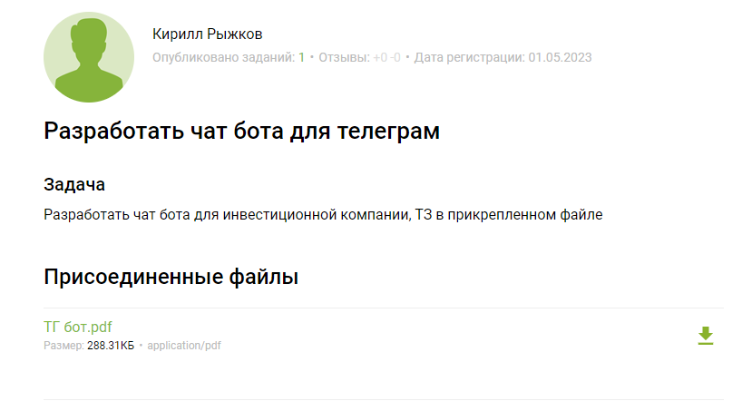
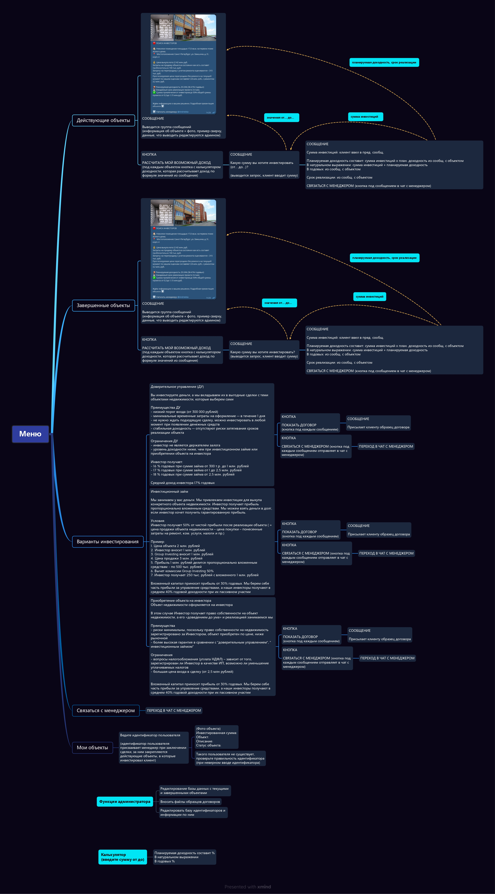

# Bot_for_an_investment_company
### Link internet cafe bot: [Nekit_investment_company_bot](http://t.me/Nekit_investment_company_bot)

Поэтому я решил выполнить заинтересовавший меня заказ на одной российской бирже фриланса, посмотреть, как там дела и как все продвигается.

Заказчик пишет: Нужно разработать бота для инвестиционной компании с прикрепленным ТЗ.
Поскольку в условии заказа не было указано время выполнения заказа, я поставил перед собой задачу выполнить его за 1 день.

Непосредственно ТЗ:

Так же вот [pdf формат](TS_on_the_bot.pdf)

## Nekit_investment_company_bot

Итак, на часах 20:20 и бот готов, а начал я в 14:00
Что ж, я считаю получилось весьма неплохо. Сначала я начал создавть таблицу на основе данных в основн