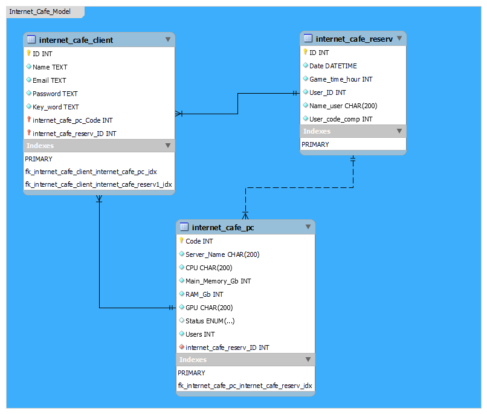

# Internet Cafe Database

Это база данных MySQL, которую я создал, чтобы продемонстрировать свои текущие навыки. Он был создан на тему интернет-кафе, как telegram-бот, поэтому, используя некоторые библиотеки и внося небольшие изменения в код бота, вы можете подключить к нему эту базу данных.

### Я использовал:
* dbForge Studio 2020 для MySQL - инструмент для написания кода и запросов, а также редактирования самих таблиц с помощью встроенных параметров Alter Table.
* MySQL workbench позволяет визуализировать результат в виде модели (диаграммы).
* Клиент командной строки MySQL для выполнения запросов.


## Internet Cafe Client

Эта таблица предназначена для хранения пользовательских данных. Это ключевая таблица, которая будет видна на диаграмме.
[Код для создания](Create_table_internet_cafe_client.sql) этой таблицы выглядит следующим образом:
```
CREATE TABLE internet_cafe.internet_cafe_client (
  ID int NOT NULL AUTO_INCREMENT,
  Name text NOT NULL,
  Email text NOT NULL,
  Password text NOT NULL,
  Key_word text NOT NULL,
  Code_Comp int NOT NULL,
  PRIMARY KEY (ID)
);
```
Здесь значения каждого столбца не могут быть нулевыми. Столбец ID является первичным ключом и использует Auto_Increment для автоматического заполнения нумерации. [Данные загружаются](Insert_internet_cafe_client.sql) в эту таблицу с помощью INSERT INTO.

Запрос:
```
SELECT *
FROM internet_cafe_client;
```
Выдаст нам:

| ID | Name        | Email                               | Password   | Key_word    | Code_Comp |
|----|-------------|-------------------------------------|------------|-------------|-----------|
|  1 | Josh        | Joshbvg25@mail.com                  | 123548Jo   | Mother      |         1 |
|  2 | Kevin       | Kevinbvg29@mail.com                 | 86597548Ke | Father      |         2 |
|  3 | Mike        | Mikebvg23@mail.com                  | 55488664Mi | Puppy       |         3 |
|  4 | James       | pivemoimaffa-6688@yopmail.com       | XVYqJeef   | reception   |         4 |
|  5 | Scott       | cissifewudau-9456@yopmail.com       | soYzlnKA   | involvement |         5 |
|  6 | Jonathan    | greugrureujoja-3427@yopmail.com     | jwNuGJQa   | motion      |         6 |
|  7 | Fred        | kunautuceddi-1364@yopmail.com       | RLicKBco   | nephew      |         7 |
|  8 | William     | greyolummewu-4727@yopmail.com       | XRbLCNAv   | coefficient |         8 |
|  9 | Thomas      | praddaudediqua-3684@yopmail.com     | QsBxTNBZ   | bucket      |         9 |
| 10 | Ronnie      | quabregrenoillei-5159@yopmail.com   | CfMqOOYZ   | sieve       |        10 |
| 11 | Edwin       | ruwufrufazoi-3206@yopmail.com       | QPWavkAg   | reputation  |         5 |
| 12 | Johnny      | ninnocregettei-5819@yopmail.com     | tnEXXHbS   | accordion   |         2 |
| 13 | Sam         | pequeupparuxou-4786@yopmail.com     | PcORTbpu   | whisper     |         7 |
| 14 | Richard     | meruffobrille-2305@yopmail.com      | JeIJSUlx   | candor      |         6 |
| 15 | Calvin      | siwoittollusse-5670@yopmail.com     | hefLTjgF   | octopus     |         1 |
| 16 | Carl        | wammeureukappi-6085@yopmail.com     | CTtqIxMS   | scorpion    |         5 |
| 17 | William     | fitriwixoite-1796@yopmail.com       | uSRyopeL   | rack        |         7 |
| 18 | Jacob       | gicevatrillei-5752@yopmail.com      | pjaHXjLg   | liturgy     |        10 |
| 19 | Thomas      | hutabrebreura-2212@yopmail.com      | QIBbEyzt   | drawer      |         8 |
| 20 | Rick        | rauddoiprillufu-3223@yopmail.com    | LBOQQaXh   | korbut      |         4 |
| 21 | Christopher | kesseuffafrenna-5035@yopmail.com    | YhPIMFzR   | sardis      |         8 |
| 22 | Michael     | quopeitittouve-4006@yopmail.com     | xlDKouWY   | abject      |         9 |
| 23 | Timothy     | zokelumoima-9316@yopmail.com        | yyhkfEaj   | andira      |         1 |
| 24 | Elmer       | voivurausuttau-7305@yopmail.com     | JTkvlYMJ   | angary      |         3 |
| 25 | Bruce       | tesseuxannequo-5033@yopmail.com     | zToUAJbV   | angina      |         2 |
| 26 | Ernest      | nipoiqueveyau-3944@yopmail.com      | GjTUmsgY   | battak      |         6 |
| 27 | Roger       | keddayileyeu-2117@yopmail.com       | fUDtCflq   | bearer      |         4 |
| 28 | Howard      | kagritrefrirei-5487@yopmail.com     | prDVXkSN   | bebled      |         8 |
| 29 | Andrew      | cagezofrissi-1060@yopmail.com       | xyOICPrL   | beltis      |         3 |
| 30 | Roy         | crennoizaddoxi-8249@yopmail.com     | UIjkctjC   | hello       |         5 |
| 31 | Antonio     | heimmeizoteille-2956@yopmail.com    | qPTuecTg   | heroic      |         7 |
| 32 | Joshua      | trawallulauppi-9033@yopmail.com     | D4B4Dh5Z   | judger      |         1 |
| 33 | James       | raufroholloullou-9388@yopmail.com   | t97d3vqE   | kishke      |         5 |
| 34 | Robert      | wufrappeipoucre-2176@yopmail.com    | AcH75jh2   | kojang      |         2 |
| 35 | Danny       | zottoufretrottau-8973@yopmail.com   | Du3bxU77   | ladies      |         9 |
| 36 | David       | ramapuceifru-8152@yopmail.com       | 429RbWsd   | lathen      |         8 |
| 37 | Jose        | graddayomaquo-3051@yopmail.com      | 5s4E3Oru   | levana      |         5 |
| 38 | Warren      | graquoizesiffau-1083@yopmail.com    | 43getvhj95 | mewler      |         7 |
| 39 | Anthony     | poucofrouwebri-9625@yopmail.com     | 4m6Lps1z7H | cute        |         3 |
| 40 | Gary        | nodoinneutteuseu-7018@yopmail.com   | V8F26nQH3R | mostly      |        10 |
| 41 | Clyde       | leidaunnacecra-5724@yopmail.com     | 8dUc6QI3R2 | navajo      |         4 |
| 42 | Christopher | soddautreitittu-1376@yopmail.com    | h0HhBs64w3 | ribose      |         6 |
| 43 | Russell     | dadeloihazi-9431@yopmail.com        | 1jINMsl690 | morpho      |         8 |
| 44 | Milton      | voufuddautono-9406@yopmail.com      | y4sBj425eJ | deltic      |         2 |
| 45 | Allan       | froteyauleussi-7742@yopmail.com     | 1x40Zt4jzJ | kopeck      |         1 |
| 46 | Raymond     | zaneuddatouru-5832@yopmail.com      | s476Jv0ef  | cutler      |         7 |
| 47 | Matthew     | queummeimmabreumou-5887@yopmail.com | 6V480ixDtK | huipil      |         9 |
| 48 | Peter       | jaxeipepouji-6411@yopmail.com       | lK5A4G27yo | naming      |         5 |
| 49 | Charles     | praxeujoibrisse-7897@yopmail.com    | GtwB91CJ37 | eileen      |         3 |
| 50 | Dwight      | sohofroloiteu-6768@yopmail.com      | n1y9EuYK21 | valuer      |         9 |


## Internet Cafe PC

Эта таблица содержит данные о компьютерах, расположенных в интернет-кафе. Он также может быть вспомогательным, если вам нужно, например, рассчитать выручку от компьютеров vip и pro, ссылаясь на их запросы на бронирование за последний месяц. Где ставка в час - 3 доллара.

Запрос на это будет выглядеть следующим образом:
```
SELECT 3*sum(Game_time_hour) AS Proceeds
FROM internet_cafe_reserv 
WHERE user_code_comp IN (
  SELECT Code 
  FROM internet_cafe_pc
  WHERE Status IN ('pro', 'vip')
);
```
С результатом:

| Proceeds |
|----------|
|111       |


[Код для создания](Create_table_internet_cafe_PC.sql) этой таблицы выглядит следующим образом:
```
CREATE TABLE internet_cafe.internet_cafe_pc (
  Code int NOT NULL AUTO_INCREMENT,
  Server_Name char(200) NOT NULL DEFAULT '',
  CPU char(200) NOT NULL DEFAULT '',
  Main_Memory_Gb int NOT NULL DEFAULT 500,
  RAM_Gb int NOT NULL DEFAULT 8,
  GPU char(200) NOT NULL DEFAULT '',
  Status enum ('def', 'pro', 'vip') DEFAULT 'def',
  Users int NOT NULL DEFAULT 0,
  PRIMARY KEY (Code)
)
```

Он отличается от предыдущего тем, что использует другой тип данных для ввода текста, имеет специальный тип данных ENUM, который хорошо подходит для ввода состояния компьютера и имеет значения по умолчанию.

[Данные загружаются](Insert_internet_cafe_PC.sql)в таблицу больше не через INSERT INTO TABLE VALUES, но вместо значений для ввода данных с помощью агрегатной функции, применяемой к другой таблице, используется SELECT.

Запрос:
```
SELECT *
FROM internet_cafe_PC;
```
Выдает нам:

| Code | Server_Name | CPU                                            | Main_Memory_Gb | RAM_Gb | GPU                                                    | Status | Users |
|------|-------------|------------------------------------------------|----------------|--------|--------------------------------------------------------|--------|-------|
|    1 | Nekit_1     | AMD Ryzen Threadripper 3990X 64-Core Processor |           2048 |     16 |  RTX 2080 Ti  TU102-300   1350Mhz 1545Mhz   11Gb GDDR6 | pro    |     5 |
|    2 | Nekit_2     | AMD EPYC 7R13 48-Core Processor                |           1024 |      8 |  GTX 1650 TU117-300 1485Mhz 1665Mhz 4Gb GDDR6          | def    |     5 |
|    3 | Nekit_3     | Intel Core I7-13700KF                          |           1024 |      8 |  GTX 980 Ti GM200-310 1000Mhz 1076Mhz 6Gb GDDR5        | def    |     5 |
|    4 | Nekit_4     | AMD Ryzen 5 7600X 6-Core Processor             |           1024 |      8 |  GTX 1080 Ti GP102-350 1480Mhz 1582Mhz 11Gb GDDR5X     | def    |     4 |
|    5 | Nekit_5     | AMD Ryzen 3 1200 Quad-Core Processor           |           1024 |      8 | GTX 1050 Ti GP107-400 1291Mhz 1392Mhz 4Gb GDDR5        | def    |     7 |
|    6 | Nekit_6     | AMD Ryzen 7 5700X 8-Core Processor             |           2048 |     16 | RTX 2060 TU106-300 1365Mhz 1680Mhz 6Gb GDDR6           | pro    |     4 |
|    7 | Nekit_7     | Intel Xeon CPU E5-2680 v3 @ 2.50GHz            |           2048 |     16 | RTX 2080 Super TU104-450 1350Mhz 1545Mhz 8Gb GDDR6     | pro    |     6 |
|    8 | Nekit_8     | AMD Ryzen 7 7700X 8-Core Processor             |           2048 |     32 | RTX 3060 GA106-300 1320Mhz 1777Mhz 8/16Gb GDDR6        | pro    |     6 |
|    9 | Nekit_9     | AMD Ryzen 9 3950X 16-Core Processor            |          10240 |     64 | RTX 3080 Ti GA102-225 1365Mhz 1665Mhz 12Gb GDDR6X      | vip    |     5 |
|   10 | Nekit_10    | Intel Xeon Platinum 8375C CPU @ 2.90GHz        |          10240 |     64 | RTX 3090 Ti GA102-350 1560Mhz 1860Mhz 24Gb GDDR6X      | vip    |     3 |


## Internet Cafe Reserv

Эта таблица уже приводилась в предыдущем пояснении. В этой таблице хранятся все запросы на онлайн-бронирование за месяц. С его помощью сотрудники интернет-кафе могут видеть, какие места будут заняты и как долго. Это поможет при оформлении заказа клиентам, пришедшим в само заведение.

[Код для создания](Create_table_internet_cafe_client.sql) этой таблицы выглядит следующим образом:
```
CREATE TABLE internet_cafe.internet_cafe_reserv (
  ID int NOT NULL AUTO_INCREMENT,
  Date datetime NOT NULL DEFAULT '2023-04-29 00:00:00',
  Game_time_hour int NOT NULL DEFAULT 1,
  User_ID int NOT NULL DEFAULT 0,
  Name_user char(200) NOT NULL DEFAULT '',
  User_code_comp int NOT NULL DEFAULT 1,
  PRIMARY KEY (ID)
)
```

В этом случае создаваемый код ничем не отличается от предыдущего. Вы можете только заметить, что здесь используется другой новый тип данных DATETIME, который позволяет вам быстро ввести дату и время бронирования, используя функцию NOW() в [ввод данных](Insert_internet_cafe_reserv.sql).
Чтобы быстро добавить данные в эту таблицу, я решил использовать INSERT INTO TABLE SELECT и selection FROM internet_cafe_client ORDER BY RAND() LIMIT 1, который позволяет выбирать случайные значения (по 1 из каждого столбца) из таблицы internet_cafe_client и добавлять их в нужную таблицу. Это позволило мне значительно сократить время на ввод данных.


Запрос:
```
SELECT *
FROM internet_cafe_PC;
```
Выдает нам:

| ID | Date                | Game_time_hour | User_ID | Name_user | User_code_comp |
|----|---------------------|----------------|---------|-----------|----------------|
|  1 | 2023-04-29 21:02:25 |              2 |      10 | Ronnie    |             10 |
|  2 | 2023-04-29 21:02:25 |              3 |      16 | Carl      |              5 |
|  3 | 2023-04-29 21:02:25 |              2 |      29 | Andrew    |              3 |
|  4 | 2023-04-29 21:02:25 |              3 |       5 | Scott     |              5 |
|  5 | 2023-04-29 21:02:25 |              4 |      25 | Bruce     |              2 |
|  6 | 2023-04-29 21:02:25 |              1 |      17 | William   |              7 |
|  7 | 2023-04-29 21:02:25 |              5 |      30 | Roy       |              5 |
|  8 | 2023-04-29 21:02:25 |              5 |      13 | Sam       |              7 |
|  9 | 2023-04-29 21:02:25 |              3 |      43 | Russell   |              8 |
| 10 | 2023-04-29 21:02:25 |              6 |       2 | Kevin     |              2 |
| 11 | 2023-04-29 21:02:25 |              5 |      39 | Anthony   |              3 |
| 12 | 2023-04-29 21:02:25 |              6 |       1 | Josh      |              1 |
| 13 | 2023-04-29 21:02:25 |              2 |       7 | Fred      |              7 |
| 14 | 2023-04-29 21:02:25 |              5 |      37 | Jose      |              5 |
| 15 | 2023-04-29 21:02:26 |              4 |       8 | William   |              8 |
| 16 | 2023-04-29 21:02:26 |              3 |       4 | James     |              4 |
| 17 | 2023-04-29 21:02:26 |              2 |      23 | Timothy   |              1 |
| 18 | 2023-04-29 21:02:26 |              1 |       3 | Mike      |              3 |
| 19 | 2023-04-29 21:02:26 |              1 |      31 | Antonio   |              7 |
| 20 | 2023-04-29 21:02:26 |              4 |      49 | Charles   |              3 |
| 21 | 2023-04-29 21:02:26 |              4 |      33 | James     |              5 |
| 22 | 2023-04-29 21:02:26 |              3 |      15 | Calvin    |              1 |
| 23 | 2023-04-29 21:02:26 |              5 |      18 | Jacob     |             10 |
| 24 | 2023-04-29 21:02:26 |              2 |       6 | Jonathan  |              6 |
| 25 | 2023-04-29 21:02:26 |              1 |      46 | Raymond   |              7 |


## И в заключение

После визуализации созданных таблиц с помощью MySQL Workbench я получил следующую диаграмму:



На нем вы можете увидеть взаимосвязи между таблицами и то, что приведенная выше таблица internet_cafe_client действительно является ключевой.

### Благодарю вас за прочтение этой документации!