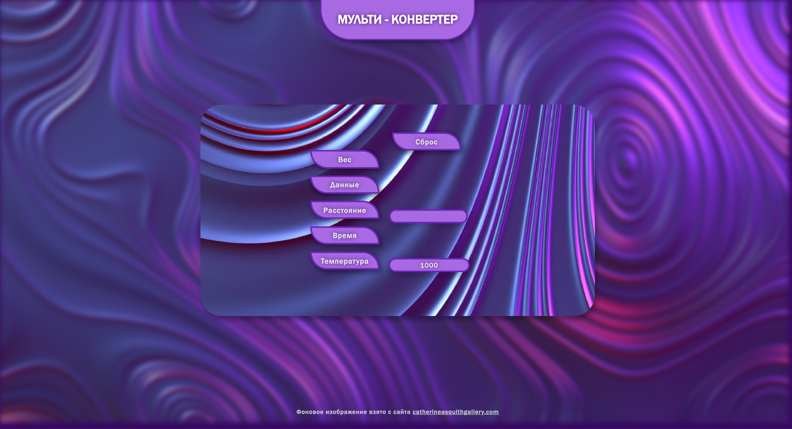

# Quantity Converter

## Background

My final project at school looked like this: [Converter.py](Converter.py). It was just a console Python script with conversion of 5 different values. I wrote it exactly a year ago, and now there is an incentive to rework it.

I submitted this project a little out of the box. Its delivery took place at the All-Russian conference "Labyrinths of Sciences", in which I decided to participate, in addition to passing the project, to earn a couple of extra points when entering the university. But it didn't work out with the scores that time. Oddly enough, I did not take the prize. It's not that I couldn't figure out what the advantages of such a primitive type of converter are, but I didn't even manage to demonstrate its work in any way. Neither the recording of the script nor the script itself started on the demo computer, but this is not surprising, because the script was not even compiled, as it should be done. Based on this, I made a decision. I decided to fix everything.

## Idea

This year I will participate in this conference again, but now my project will be completely different. I analyzed all my mistakes and realized that writing Python code in any other form is not an option. A very interesting idea immediately came to me: "Why not make a website with the same functionality?". Indeed, it turned out to be a very correct decision. 4 months have passed since the "layout" of the MaksyMarket website, and I have learned a lot.

## The layout process

This time I immediately started the layout, and made a full-fledged website from scratch. This time I used JavaScript as the language for the script, which in any case would have turned out to be much more practical than a naked Python script. The most important advantage of this approach is that now the converter will run on any computer where there is not only Internet access, but even a simple browser like Microsoft Edge, etc. After all, browsers are essentially compilers of HTML, CSS and JavaScript code. Therefore, to work with the converter, it is enough to simply run the main HTML file of the page. And the opportunity to somehow stylize or even just create an interactive interface already gives a huge boost to the development of the project. Now I am limited only by my imagination.

I had a week to create a website. In the first 2 days, I developed the concept of the interface for the most intuitive use. From day 3 to day 4, I developed a basic JavaScript script in which I implemented both the main functions of the interface and the computing blocks themselves (of course, more time was spent implementing the interface, since this was the first time I encountered most of the ways to implement a particular function). On the 5th and 6th day, I took up styles for the site. I came up with the design on the go, so the styling took a little longer, but by the middle of the 6th day I managed to finish it. The next half of the 6th day and until the end of the 7th inclusive, I was engaged in the adaptability of the site, as well as fixing minor bugs. Well, in the end, here is [the result of my work](index.html):

also [pdf format](Converter.pdf)

## The process of re-submitting the project

An application has already been submitted for participation in the conference, the 1st stage will soon begin, where projects that have absolutely not stood out are pre-screened out. In fact, it is unlikely that it will be difficult for me to pass this way, because I passed that project with that, so even more so with this. I forgot to mention that a written project on this topic should also be attached to the project, where the whole process of site layout in this case is also described later. I will not attach it to the project on GitHub, since only examples of my skills are important here, and I set out everything about "what, where and why" in a (really tedious) written project.

*(In place of this text, information on the promotion of my project by stages will soon appear.)*