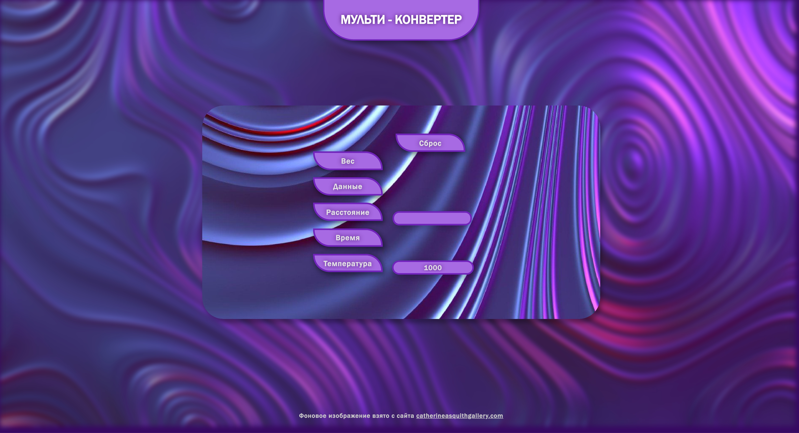

# Конвертер величин

## Предпосылка

Мой итоговый проект в школе выглядел вот так: [Converter.py](Converter.py). Это был всего лишь консольный Python скрипт с конвертацией 5 разных величин. Написал я его ровно год назад, и теперь появился стимул его переработать.

Я сдавал этот проект немного не стандартно. Его сдача происходила на всероссийской конференции "Лабиринты наук", в которой я и решил поучаствовать, что бы помимо сдачи проекта заработать пару лишних баллов при поступлении в университет. Но в тот раз с баллами не задалось. Как не странно, я не занял призовое место. Дело не в том, что я не мог понять, в чем преимущества такого примитивного типа конвертера, но мне даже не удалось каким-либо образом продемонстрировать его работу. Ни запись работы скрипта, ни сам скрипт не запустились на демонстрационном компьютере, но это и не удивительно, ведь скрипт был даже не скомпилирован, как это подобало бы сделать. Исходя из этого я принял решение. Я решил все исправить.

## Задумка

В этом году я снова поучаствую в этой конференции, но теперь мой проект будет абсолютно иным. Я проанализировал все свои ошибки и понял, что писать код на Python в каком либо другом виде не вариант. Ко мне сразу же подобралась весьма интересная идея: "Почему бы не сверстать сайт с тем же функционалом?". И вправду, это оказалось весьма правильным решением. С момента "Недоверстки" сайта "MaksyMarket" прошло 4 месяца, и я многому научился. 

## Процесс верстки

В этот раз я сразу приступил к верстке, и с нуля сверстал полноценный сайт. В этот раз в качестве языка для скрипта я использовал JavaScript, что в любом случае оказалось бы куда практичней голого скрипта на Python. Самое главное преимущества такого подхода в том, что теперь конвертер запустится на любом компьютере, где есть не то что доступ в интернет, но даже простой браузер по типу Microsoft Edge и др. Ведь по своей сути браузеры, это компиляторы HTML, CSS и JavaScript кода. По этому для работы страницы с конвертером достаточно просто запустить главный HTML файл страницы. Да и возможность хоть как то стилизовать или даже просто создать интерактивный интерфейс уже дает огромный толчок в развитии проекта. Теперь я ограничен только своим воображением.

На создание сайта у меня была неделя. В первые 2 дня я разрабатывал концепцию интерфейса для максимально интуитивно понятного пользования. С 3 по 4 день я разрабатывал основной скрипт на JavaScript, в котором я реализовывал как основные функции интерфейса, так и сами вычислительные блоки (большее количество времени конечно ушло на реализацию интерфейса, так как я в первый раз сталкивался с большинством путей для реализации той или иной функции). В 5 и 6 день я занялся стилями для сайта. Дизайн я придумывал на ходу, так что стилизация немного затянулась, но к середине 6 дня у меня так и получилось ее доделать. Следующую половину 6 дня и до конца 7 включительно я занимался адаптивностью сайта, а так же исправлял мелкие баги. Ну и в конце концов вот [результат моей работы](index.html):

так же [pdf формат](Converter.pdf)

## Процесс повторной сдачи проекта

Уже была подана заявка на участие в конференции, вскоре должен будет начаться 1 этап, где предварительно отсеиваются проекты, которые абсолютно ничем не выделились. На самом деле пройти этот этак вряд ли у меня составит труда, ведь я с тем проектом и то прошел, значит с этим и подавно. Я забыл упомянуть, что к проекту так же должен прилагаться письменный проект по этой теме, где уже в последствии так же описывается весь процесс в данном случае верстки сайта. Я не стану прилагать его к проекту на GitHub, так как тут важны лишь примеры моих навыков, а как раз все по поводу "что, где и зачем" я излагал в (на самом деле нудном) письменном проекте.

*(На месте этого текста вскоре появится информация по продвижению моего проекта по этапам.)*