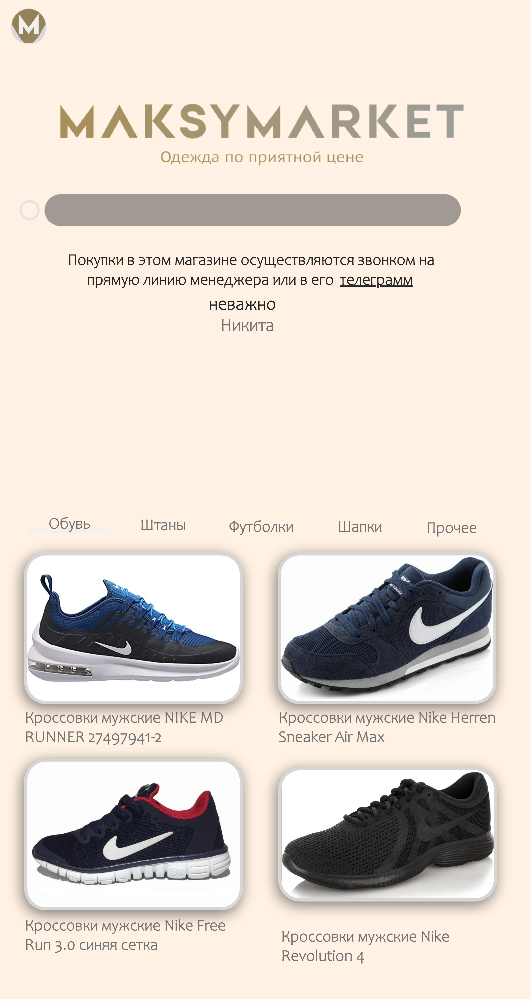
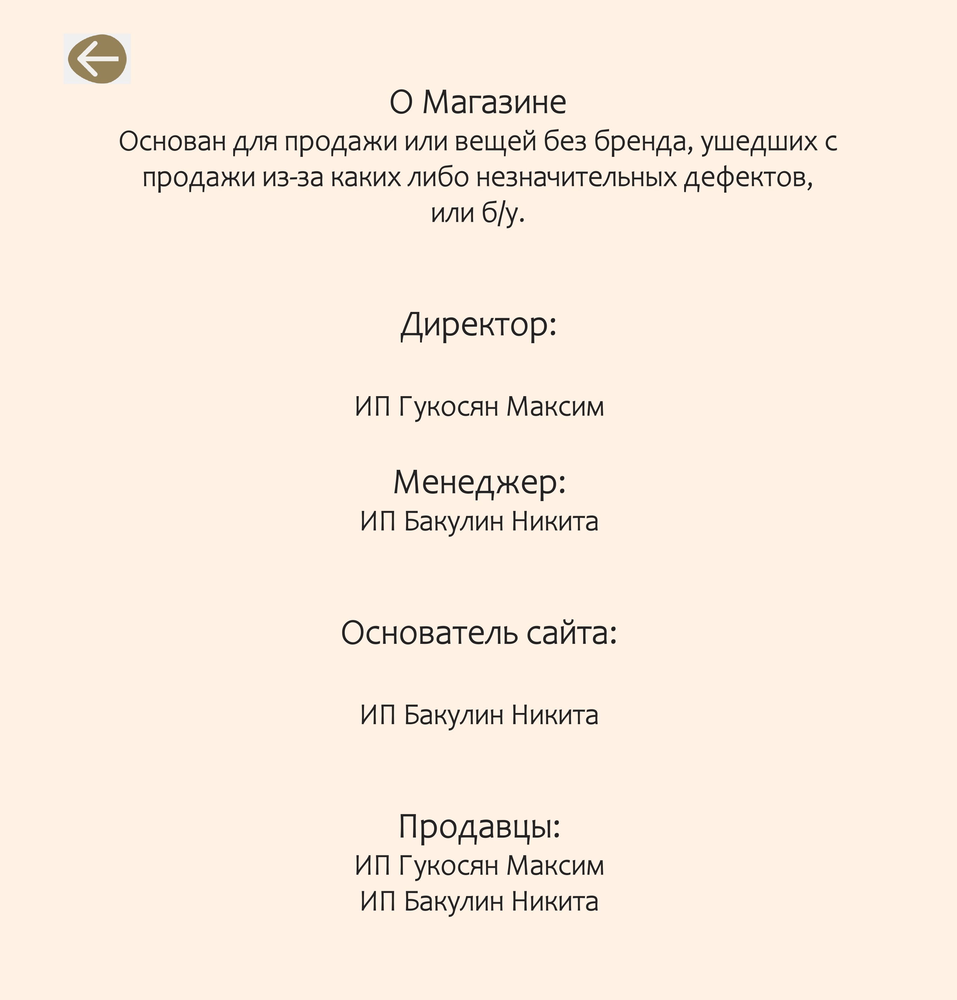
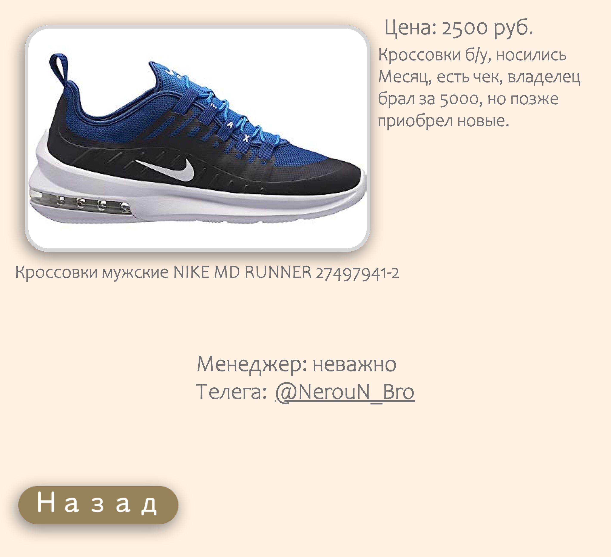

# Интернет магазин - MaksyMarket

## Задумка

Как то раз меня и моего друга Максима посетила мысль открыть малый бизнес на продаже вещей с дефектом при производстве или б/у, закупаемых оптом с одноименных рынков, по ценам ниже рынка продажи б/у вещей в России Avito.

Для высоких продаж недостаточно просто опубликовать объявления по более низкой цене на одном лишь Avito. Для повышения охвата мы планируем так же опубликовать объявления в VK и Telegremm. В каждом из подобных объявлений мы планируем включать ссылку на полный каталог товаров, который и будет находиться на нашем сайте.

## Реализация

### Дизайн
Для начала я разработал дизайн в [Figma](MaksyMarket.fig). Каталог состоит из 5 видов товаров - обувь, штаны, футболки, шапки и прочее. В отличие от всего остального, во вкладке прочее будут разного рода акции, предложения и одежда, не подходящая ни под одну из категорий. Информация об этом будет располагаться между моим именем и кнопками переключения вкладок с каталогом. 

так же [pdf формат](localhost_8000_index.html.pdf) 

Так же на главной странице присутствует кнопка в левом верхнем углу, она перенаправляет пользователя на вкладку "О магазине". На ней собрана информация о магазине и все должностные лица.

так же [pdf формат](localhost_8000_O_mag.html.pdf)

При нажатии на определенный товар пользователь увидит фото товара в более большом формате, а справа будет располагаться цена на товар и его подробное описание. Ниже будут располагаться контакты связи с менеджером для осуществления покупки и кнопка "назад", которая возвращает пользователя в тот раздел каталога, где находится товар.

так же [pdf формат](localhost_8000_NIKE-MD-RUNNER-27497941-2.html.pdf)

### Верстка

Далее нужно было сверстать полноценный сайт с дизайна figma. В этой задаче мне хорошо помог сервис [pxcode](https://www.pxcode.io), который после ручного объединения всех объектов в "дивы", что осуществляется все в том же сервисе, выдает html код страницы и ее стиль в виде scss, потом переделанный в css. Так как бесплатные услуги сервиса работает не идеально, мне пришлось вручную корректировать размеры объектов, расположение, цвет и анимации. Так же сервис не включил в html код кнопки, которые я так же добавлял вручную.

### Публикация

Что ж, сайт готов, осталось его только захостить. Название интернет магазина хорошо подходит и под домен сайта, так как с таким ключевым словом нет ни одного домена. Я остановился на домене maksymarket.ru, так как зона ".ru" самая дешёвая. Осталось только определиться с сервисом хостинга. На этот случай у меня есть 2 варианта. 1 - просто найти любой онлайн-сервис с хостингом, но при этом заплатить определенные деньги. 2 - использовать мой 2 компьютер как сервер для сайта, использую программу [open server](https://ospanel.io).

Стартап еще не начался, поскольку для него у нас сейчас присутствует не вся сумма, и по этому домен я пока не приобретаю. После начала стартапа я приобрету домен и буду пользоваться 2 компьютером в роли сервера для теста надобности сайта, так как в программе open server есть хорошая система "логов", которые будут говорить мне, когда и сколько адресов подключались к серверу. Если основная часть покупок будет совершаться через этот сайт, значит от него есть выгода и непосредственно прибыль, часть от которой можно будет тратить на хостинг в проверенном сервисе.

После начала стартапа тут будет сводка о работе сайта и видео с его опубликованной версией. 
