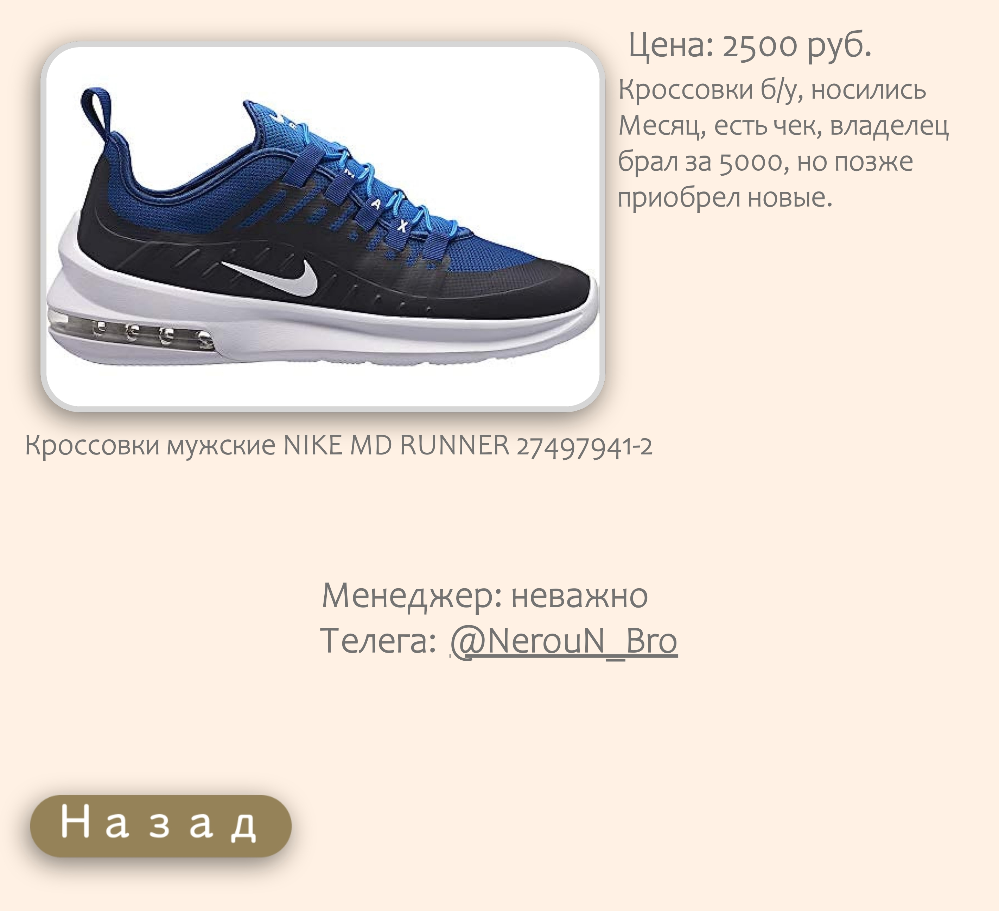

# Online store - Maksimarket

## Idea

Once, my friend Maxim and I had the idea - to open a small business selling things with a defect in production or used, purchased in bulk from the markets of the same name, at prices lower than the market for selling used things in Russia Avito.

For high sales, it is not enough just to publish ads at a lower price on Avito alone. To increase coverage, we also plan to publish ads in VK and Telegram. In each of these ads, we plan to include a link to the full catalog of products, which will be on our website.

## Implementation

### Design
To begin with, I developed the design in [Figma](MaksyMarket.fig). The catalog consists of 5 types of goods - shoes, pants, T-shirts, hats, etc. Unlike everything else, in the other tab there will be all sorts of promotions, offers and clothes that do not fit any of the categories. The information about this will be located between my name and the buttons for switching tabs with the catalog. 

also [pdf format](localhost_8000_index.html.pdf) 

Also on the main page there is a button in the upper left corner, it redirects the user to the "About store" tab. It contains information about the store and all officials.

also [pdf format](localhost_8000_O_mag.html.pdf)

When clicking on a certain product, the user will see a photo of the product in a larger format, and the price of the product and its detailed description will be located on the right. Below there will be contacts of communication with the manager for making a purchase and a "back" button, which returns the user to the section of the catalog where the product is located.

also [pdf format](localhost_8000_LIKE-MD-RUNNER-27497941-2.html.pdf)

### Layout

Next, it was necessary to make a full-fledged website with a figma design. The [pxcode](https://www.pxcode.io ) service helped me well in this task , which, after manually combining all objects into "divs", which is carried out in the same service, outputs the html code of the page and its style in the form of scss, then converted to css. Since the free services of the service does not work perfectly, I had to manually adjust the size of objects, location, color and animations. Also, the service did not include buttons in the html code, which I also added manually.

### Publication

Well, the site is ready, it remains only to host it. The name of the online store is also well suited for the site domain, since there is not a single domain with such a keyword. I settled on the domain maksymarket.ru , since the zone ".ru" is the cheapest. It remains only to decide on the hosting service. In this case, I have 2 options. 1 - just find any online service with hosting, but at the same time pay some money. 2 - use my 2 computer as a server for the site, using the program [open server](https://ospanel.io ).

The startup hasn't started yet, because we don't have the whole amount for it right now, I'm not buying a domain yet. After the start of the startup, I will purchase a domain and use 2 computers as a server to test the site's need, since the open server program has a good system of "logs" that will tell me when and how many addresses were connected to the server. If the bulk of purchases will be made through this site, then there is a benefit from it and directly profits, part of which can be spent on hosting in a proven service.

After the start of the startup, there will be a summary of the work of the site and a video with its published version.